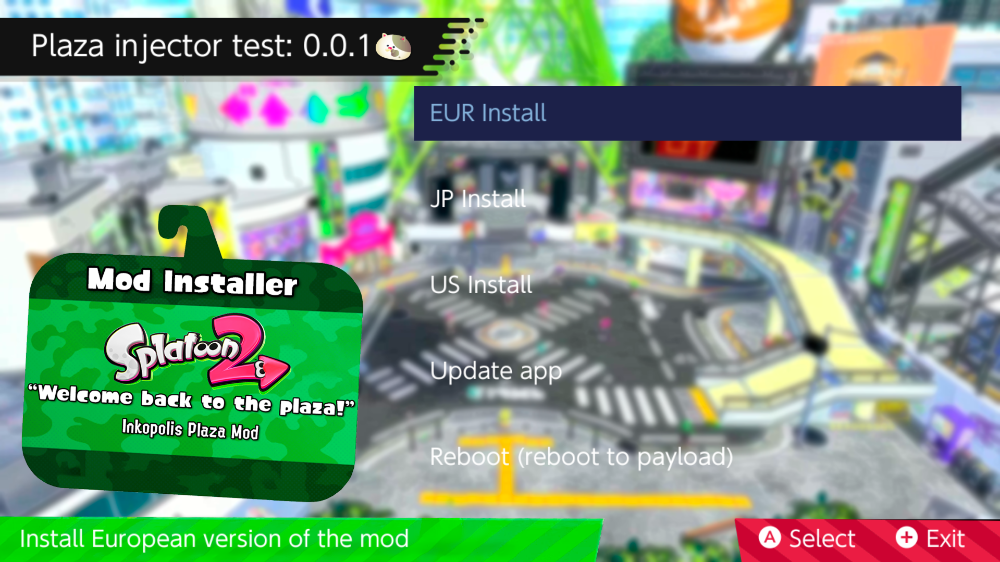

----

## Project_Gamblitz-injector

Download the "Welcome to the plaza" mod directly from your Nintendo Switch!

----

# Install

Download the the latest release from [here](https://github.com/nacho95101/plaza-mod-injector/releases/download/wip/plaza-mod-injector.nro).

Move the downloaded .nro onto you nintendo switch sd card inside the folder **/switch/atmosphere-updater**.

That's it!

----

# Usage

__**Just click your Splatoon 2 game region and wait until it's done!**__

**Update App:**

* Downloads the latest version of this app straight from github!
* Deletes the previous old version.

**Reboot (reboot to payload):**

* I'll probably remove this feature in the future since it's useless
----

# Build

Install the Devkitpro tool chain from [here](https://devkitpro.org/wiki/Getting_Started).

 Using pacman (installed with devkitpro) install the following libraries:
* switch-curl
* switch-freetype
* switch-sdl2
* switch-sdl2_gfx
* switch-sdl2_image
* switch-sdl2_ttf
* switch-zlib

If you have any problems building, feel free to open an issue including any build errors.

----

